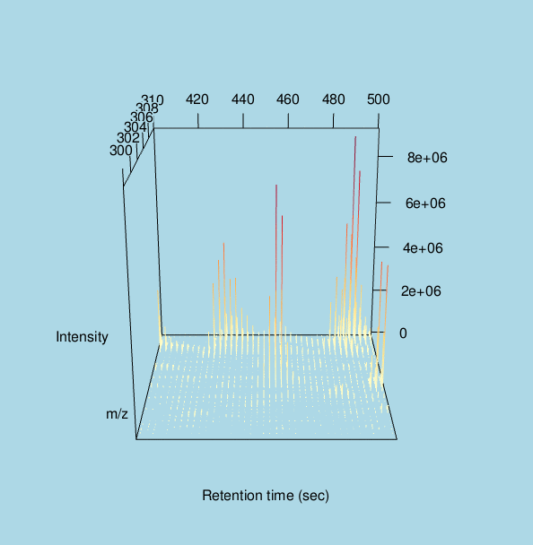

* * *

**emissary**
[em-*uh*-ser-ee]

noun, plural *emmissaries*

1. a representative sent on a mission or errand:  
   *emissaries to negotiate a peace.*
2. an agent sent on a mission of a secret nature, as a spy.
3. *Anatomy*. sending or coming out, as certain veins that pass through the 
skull and connect the venous sinuses inside with the veins outside.
4. pertaining to an emissary.

adjective

5. *Archaic*. sent forth, as on a mission.

in software

6. a package sent forth to change the way you interact with mass spectrometry
data.

*source:* [Dictionary.com](http://dictionary.reference.com/browse/emissary) 
...*with modifications*

* * *
```{r, eval=TRUE, echo=FALSE, results='hide', message=FALSE}
require(knitr)
opts_chunk$set(fig.width=9, fig.height=6, dpi=108)
unlink(system.file('extdata', 'Shew_slice1.sary', package = 'MSsary'))
```

## Introduction
MSsary is a package designed to make it easier to work with mass spectrometry 
(MS) data in R. It both facilitates investigations of the raw data, making 
different preprocessings of it and identifying and quantifying peaks. As such it
shares a scope with the venerable 
[xcms](http://www.bioconductor.org/packages/release/bioc/html/xcms.html) 
package, but makes several changes to the design that makes it easier to trace 
the raw data through the different steps, makes it easier to extend and 
dramatically decreases the memory footprint of working with large MS data files,
while still maintaining fast data access.

This vignette will describe the basics of MSsary for working with MS data, while
another vignette will go into detail on how to extend the functionality of 
MSsary with your own algorithms.

### The emissary' missions
1. To be extremely lightweight. This is done using two paradigms:

   * Only ever have data in-memory if it is needed
   
   * Provide transparent iterators over data for cases where all necessary data
   cannot fit in memory at one time.

2. To be very fast. All functions are either properly vectorized or have an
underlying Rcpp implementation.

3. To be very intuitive. Accessing and working with mass spectrometry data 
should not require the user to write complex indexing schemes to get to the data
needed, but rely on the inherent power of the provided classes.

4. To provide easy access to the underlying data. While the provided classes all
make it easier to navigate MS data sets, the underlying data should always just
be a single method call away.

5. To be easily extensible. See the 'Extending MSsary vignette'.

The above points summarize the objective of the package, but since this is a 
tall order, they may not all be fullfilled in the first release. They should 
thus be viewed upon as a very high-level roadmap for the package.

##<a name="infrastructure"></a> Infrastructure
This section will describe the overall infrastructure of the package. If you are
more interested in getting your hands dirty with some real examples, please skip
to the next [session](#rawData).

##<a name="rawData"></a> Interacting with raw data
While most of the power of MSsary unlocks when you begin to extract derived data
from your raw data, it also contains the means to investigate and navigate the
pure, unmodified raw data.

### Opening a raw data file
MSsary relies on 
[mzR](http://www.bioconductor.org/packages/release/bioc/html/mzR.html) for 
reading in raw data. As such it supports all formats that are supported by mzR,
but mzML is the preferred vendor neutral format.

To open up a raw file for the first time and create an MsData object is easy:
```{r, echo=TRUE, eval=TRUE}
library(MSsary)
library(ggplot2)

mzMLfile <- system.file('extdata', 'Shew_slice1.mzML', package = 'MSsary')

msData <- createMsData(mzMLfile)
msData
```

This creates a new file besides the raw file with the .sary file extension. This
file contains all additional data that gets generated while working in MSsary 
and allows for persistency in the data between R sessions. Furthermore, as it is
SQLite based, it can be accessed from other programming environments if this is 
desired (see the first [section](#infrastructure) for more about the 
infrastructure). As can be seen from the above, the sary file includes a history
of what has happened during analysis. This information includes a timestamp, a 
description, the MSsary version used, the name and version of extension packages
as well as the file call used to make the modification.

To load in an already created MSsary analysis, the `loadMsData()` function is
used instead. It takes both the raw and the sary file as arguments:

```{r, eval=TRUE, echo=TRUE}
saryFile <- file.path(dirname(mzMLfile), 'Shew_slice1.sary')
rm(msData)

msData <- loadMsData(mzMLfile, saryFile)
```

MsData objects are designed to be extremely lightweight, making it easy to have 
hundreds of files open at the same time:

```{r, eval=TRUE, echo=TRUE}
object.size(msData)
```

### Extracting data from MsData objects
Once an MsData object have been created it is possible to access the underlying
data in an easy and intuitive way. For pure unaltered MsData objects the main
data types are scans and chromatograms.

#### Extracting scans
The most direct way to access scans is to pass a vector of acquisition numbers,
matching the scans you wish to extract:

```{r, eval=TRUE, echo=TRUE}
msScans <- scans(msData, 2401:2405)
msScans
```

Acquisition number are seldom very meaningful though, so instead it is possible
to pass different filtering options instead, such as MS level, retention time,
number of ions etc.

```{r, eval=TRUE, echo=TRUE}
msScans <- scans(msData, msLevels=2, retentionTime=c(400, 402))
msScans
```

The generated object is an MsScanList object. For all intent and purpose it can 
be regarded as a list of matrices with mz and intensity information for each 
scan. It comes with a few extra bells and whistles though, the most prominent 
being that it retains a connection to the data from which is was derived from.
This makes it possible to easily navigate to related scans:

```{r, eval=TRUE, echo=TRUE, results='hide'}
msChild <- msScans[1]                # Subsetting of MsScanList
nextScan(msChild, sameLevel = FALSE) # Get next consecutive scan
msParent <- parent(msChild)          # Get the parent scan of fragmentations
nextScan(msParent, sameLevel = TRUE) # Get next scan with same level
children(msParent)                   # Get fragmentations from this scan
siblings(msChild)                    # Equivalent to above
```

If you need to get the underlying data in a more standard R format, these can be
extracted with two functions

```{r, eval=TRUE, echo=TRUE}
msInfo(msScans)[, 1:4]               # Get metadata about the scans
scanRaw <- msData(msScans)           # Get scan data as a list of matrices
head(scanRaw[[1]])
```

At last it also have a very powerful plotting function that can take all this
extra information into account.

```{r, eval=TRUE, echo=TRUE}
### TO BE WASTLY IMPROVED
msPlot(msScans)
msPlot(msParent)
msPlot(msChild)
```

#### Extracting chromatograms
As with scans, it is also possible to extract data in the time dimension. The
syntax is very much the same, and so is the returned object (though it does not
have nextScan, parent etc. methods as they would be meaningless). By default it
extracts the full chromatogram for level 1 scans:

```{r, eval=TRUE, echo=TRUE}
msChrom <- chroms(msData)
class(msChrom)
msPlot(msChrom)
```

As can be seen from the plot, the MsChromList object contains both TIC and BPC
data, so these do not need to be extracted separately. Extracted ion 
chromatograms (XIC) can be created by setting m/z and either retention time or 
scan number windows.

```{r, eval=TRUE, echo=TRUE}
mzWins <- matrix(c(400, 500, 500, 600), ncol=2, byrow=TRUE)
rtWins <- matrix(c(300, 500, 400, 600), ncol=2, byrow=TRUE)
msXIC <- chroms(msData, retentionTime=rtWins, mzRange=mzWins)
msPlot(msXIC)
```

The scans that make up a chromatogram can easily be extracted with the `scans()`
method. Note that this extracts the full scans and thus ignores any m/z window
used for the XIC from where they are derived.

```{r, eval=TRUE, echo=TRUE}
msXIC <- chroms(msData, retentionTime=c(480, 510))
msPlot(msXIC, collapse=TRUE)
```

```{r, eval=TRUE, echo=TRUE, fig.height=12}
msScans <- scans(msXIC)[[1]]
BPCwin <- msInfo(msScans)$basePeakMZ[which.max(msInfo(msScans)$basePeakIntensity)] + c(-2, 2)
msPlot(msScans) + coord_cartesian(xlim=BPCwin, ylim=c(-0.25e8, 3.5e8))
```

This also shows a major design philosophy behind MSsary. Navigation between one
type of data and another type of related data should be easy and natural. If 
ever you need the scans that are related to an object, `scans()` is there to 
save your day.

### Extracting ions
While the MsScanList and MsChromList object are fine for working with slices of
data it is also possible to extract the raw triplets of data (retention-time, mz
and intensity). These are stored in an MsIonList and are often used to visualy
instpect an area of your data

```{r, eval=TRUE, echo=TRUE}
msIons <- ions(msData, retentionTime=c(400, 500), mzRange=c(300, 310))
msIons
```

MsIonLists can be investigated using two different plot types:

```{r, eval=TRUE, echo=TRUE}
msPlot(msIons)
```

Besides the standard 'synthetic gel' plot a 3D plot is also avaliable for those
with the rgl package installed. This can be beneficial as subtle colour changes
can be difficault to discern in a heatmap.

```{r, eval=FALSE}
msPlot(msIons, '3d')
```


MsIonList object of course also support the same linking as described for 
MsChromList object, so MsScanList and MsChromList objects can be easily derived

```{r, eval=TRUE, echo=TRUE}
chroms(msIons)
scans(msIons)
```

## Analysing raw data
While investigating raw data is an important step in making sure that everything
is as it should be, MS data is seldom interesting in its raw, unprocessed form.
MSsary breaks up the MS analysis step up in a familiar number of steps, that 
will be described below:

* Preprocessing of data.
* Peak detection.
* Grouping of peaks within a sample.
* Grouping of peaks across samples.

Often these operation will be done on MS1 data, but there is no inherent 
constraint in MSsary for that. If peaks need to be detected in the MS2 level due
to an SRM-like setup, this is supported out of the box. Another operation that
is often done as part of a proteomics workflow is the identification of peptides
from MS2 scans. This operation is not build into MSsary itself but can be 
accessed through other R packages (see 
[MSGFplus](http://bioconductor.org/packages/release/bioc/html/MSGFplus.html) and
[rTANDEM](http://www.bioconductor.org/packages/release/bioc/html/rTANDEM.html) 
for instance). Instead MSsary offers the possibility of incoorporating results
from identifications into the pipeline so quantified peaks can easily be merged
with identification results and IDs can be extrapolated between samples. In fact
any type of identification (handwave to lipidomics and metabolomics) can be 
incoorporated into MSsary as long as the results object provides certain getter 
methods (see 
[mzID](http://www.bioconductor.org/packages/release/bioc/html/mzID.html) for a 
format that complies).

### Preprocessing of data
To be done

### Peak detection
To be done

### Grouping of peaks within a sample
To be done

### Grouping of peaks across samples
To be done

## Pipelines
When using MSsary you might find a certain lack of default values for the 
different algorithms. This is by design due to the belief that defaults are the
lazy substitute for getting acquainted with your data. In MSsary defaults are 
only given in the circumstances where there is a definite norm, and any other 
value would be a deviation from the norm. To illustrate this let us look at the 
xcms implementation of the centWave algorithm. It comes with defaults for ppm,
peakwidth, snthresh and prefilter to name a few. There is nothing in either MS
data nor the algorithm that specifies that these defaults are meaningfull to the
vast majority of cases, but their status as defaults indicate just that.

MSsary wants to do away with this and instead require the user to make a 
conscious decision based on the data at hand. Still it can get tedious to 
reenter the same values again and again (as some parameters remains the same for
a certain instrument or setup), so to avoid this MSsary makes it possible to
create pipelines. Pipelines defines a certain sequence of analyses and makes it 
possible to supply default values for same or all of the parameters.

### Creating a pipeline
To be done

### Using a pipeline
To be done

## Session
```{r, eval=TRUE, echo=TRUE}
sessionInfo()
```
